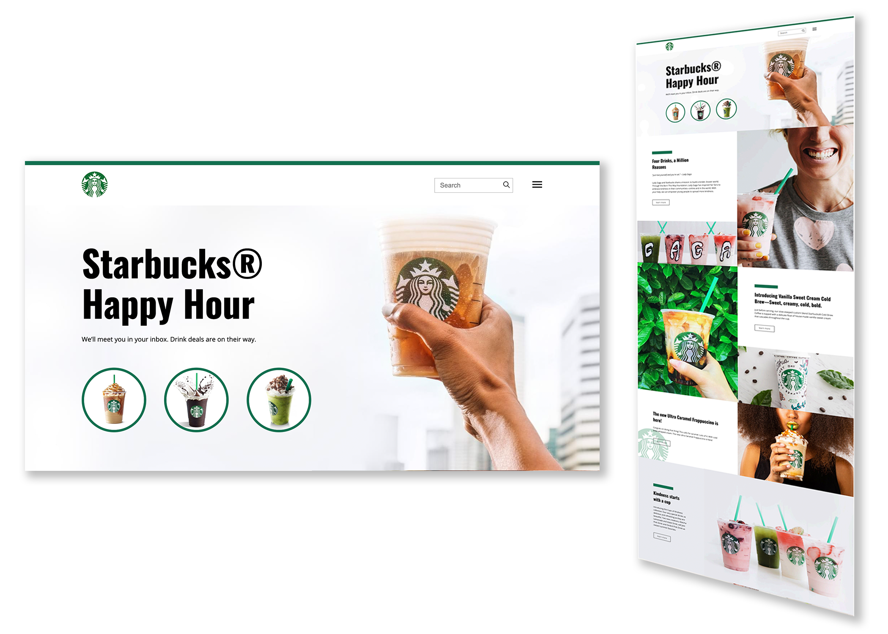

# Projeto Starbucks Grid Layout - Projeto B7Web

Este projeto foi desenvolvido como parte do curso da B7Web, com o objetivo de ensinar e praticar o uso do CSS Grid na construção de layouts modernos e responsivos.

## Descrição

O projeto simula o site de uma empresa fictícia, oferecendo informações sobre os serviços prestados, projetos realizados, e outras seções típicas de um site corporativo. Ele conta com um layout responsivo, que se adapta a diferentes tamanhos de tela, utilizando apenas HTML e CSS.

 

## Funcionalidades

-  Layout responsivo utilizando CSS Grid;
-  Elementos estilizados para simular uma página oficial;
-  Estrutura semântica e organizada;

## Tecnologias Utilizadas

- **HTML5**: Estrutura básica do conteúdo da página.
- **CSS3**: Foco em CSS Grid

## Como Rodar o Projeto
Projeto pode ser rodado através de https://yvasques.github.io/starbucks-grid/
